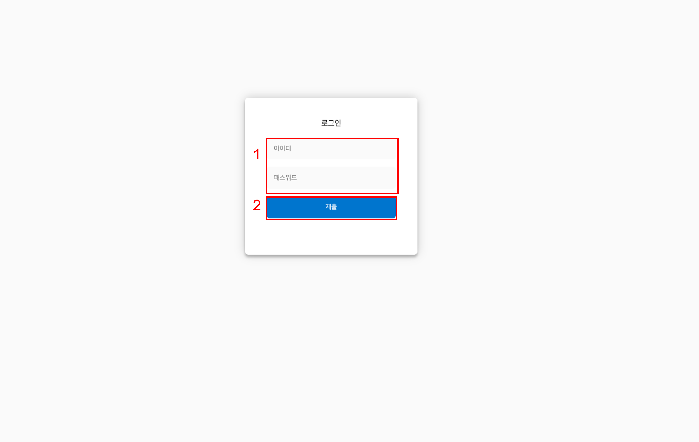
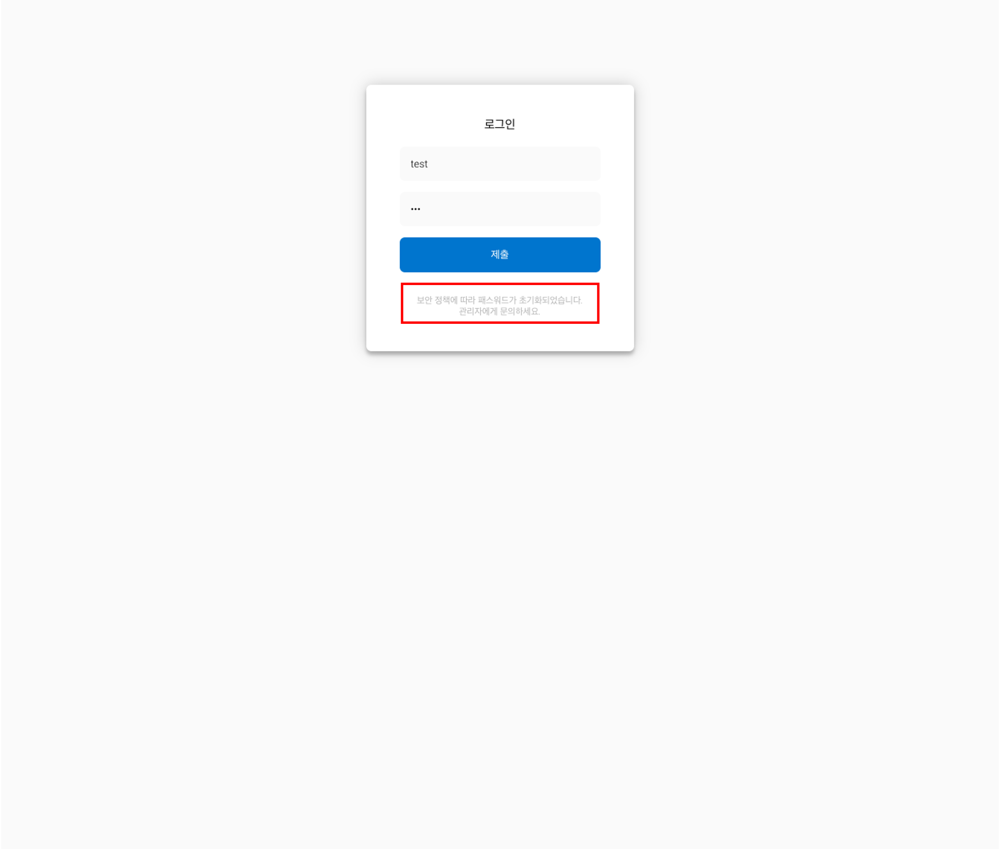
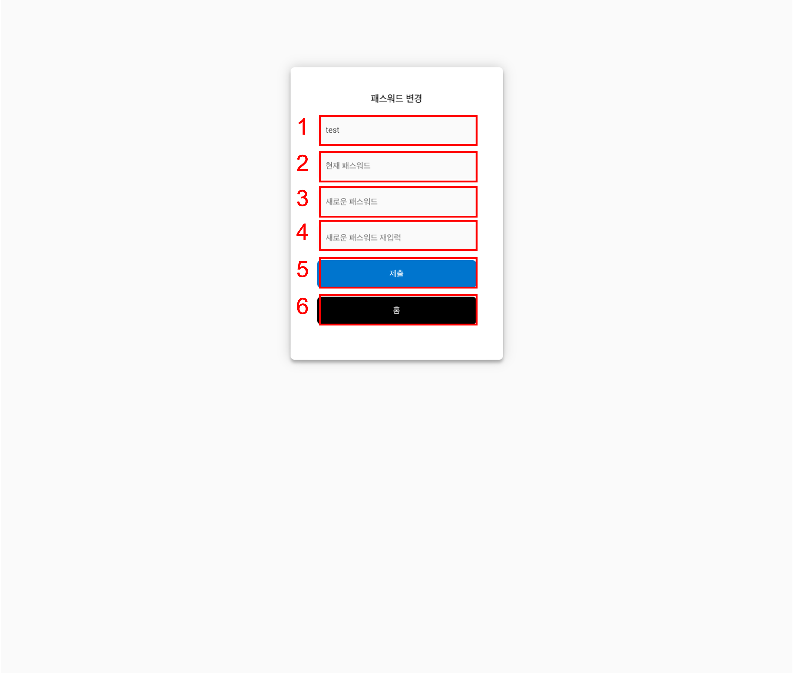
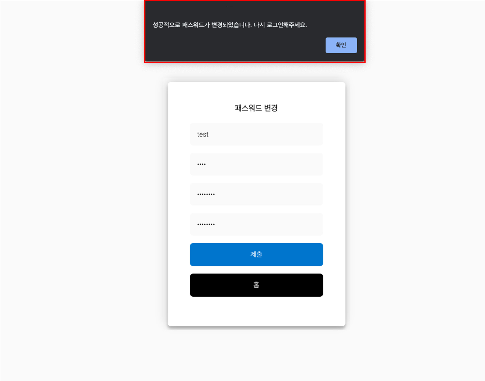
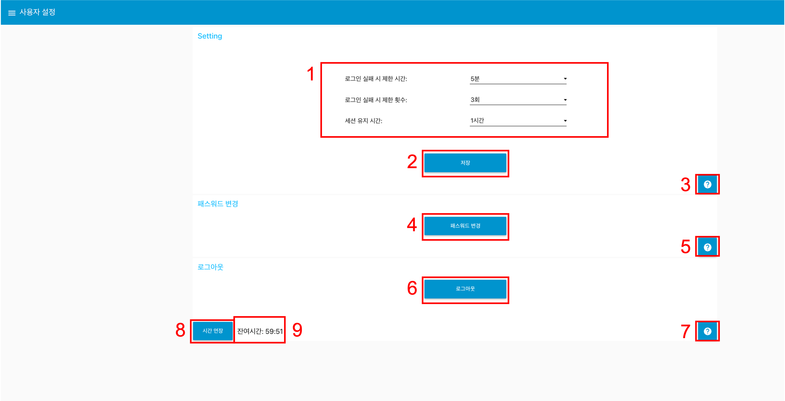

---

sort: 1

---

# 사용자 관리

## 로그인

학습플랫폼을 이용하기 위해 로그인이 필요하다. 

  

1. 첫 화면에는 **아이디**와 **패스워드**를 입력하는 란이 포함된 **로그인** 화면이 표출된다.
2. 아이디와 패스워드를 입력하면, 첫번째 탭 화면으로 이동된다.

  

### 로그인 페이지 구성

  
  
1.아이디와 패스워드입력란 : 아이디와 패스워드를 입력한다. 
2.로그인 버튼 : 아이디, 패스워드를 입력 후, Submit 버튼을 누른다. 
  - 빈 칸으로 제출하면 아래 화면과 같은 "아이디를 입력해주세요." 또는 "패스워드를 입력해주세요." 문구가 표출된다.

  

  - 만약 입력한 정보가 맞지 않다면 아래 화면과 같은 "아이디 또는 비밀번호가 일치하지 않습니다. 다시 시도해주세요." 문구가 표출된다. 
   
   

**※ 보안상의 이유로 하나의 IP, 하나의 클라이언트에서 로그인 상태를 활성화 할 수 있습니다.**
**동일한 IP 내 다른 클라이언트에서 로그인을 시도할 경우 중복 로그인 정책에 따라 강제 로그아웃되며, 비밀번호 노출 의심시 비밀번호를 변경해주시기 바랍니다.**

  

## 비밀번호 초기화

로그인 화면 비밀번호를 사용자가 설정한 시간 내에 설정한 일정 횟수 이상 틀리게 되면, 보안 정책에 따라 비밀번호가 초기화 된다. 초기화가 되고 나면 더 이상 로그인이 불가능하며, 관리자에게 문의를 해야한다. 

  

1. 기본적으로 5분 이내에 3번 이상 패스워드를 틀리게 된다면, 강제로 패스워드가 초기화가 되며 더 이상 로그인이 불가능해진다.

 
※ 패스워드가 초기화 되었다면, 관리자에게 문의하여 주시기 바랍니다.

  

## 로그아웃

로그아웃은 왼쪽 상단 탭 선택 후, 사용자 설정 탭 선택 후 로그아웃 버튼을 클릭하여 진행한다. 로그아웃 시, 로그인 화면으로 돌아간다. 

  

1. 왼쪽 상단 탭을 선택한다.
2. 탭목록에서 사용자 설정을 선택한다.
3. 로그아웃 버튼을 클릭한다.
4. 로그아웃 시, 로그인 화면으로 돌아간다.

  

## 비밀번호 변경

비밀번호를 변경하기 위해서는 로그인을 한 상태에서, 아래 화면과 같이, 왼쪽 상단 탭을 선택 후, 사용자 설정 탭을 선택 후, 패스워드 변경을 클릭하여, 진행한다. 

  

비밀번호 변경은 아래와 같이 진행된다. 

  

1. 현재 로그인 한 사용자의 username 이다.
2. 현재 비밀번호를 입력하는 란이다.
3. 새로운 비밀번호를 입력하는 란이다.
4. 새로운 비밀번호를 재 입력하는 란이다.
5. 비밀번호를 변경하기 위한 제출 버튼이다.
6. 비밀번호를 변경하지 않고 돌아가고 싶다면 `GO HOME` 버튼을 클릭해 홈 화면으로 이동할 수 있다.

  

현재 패스워드, 새로운 패스워드, 새로운 패스워드 재입력을 입력한 후, 다음 버튼을 선택한다. 만약 아래와 같은 상황들은 에러 메세지가 나타나고 변경되지 않는다.
1. 새로운 비밀번호의 길이기 4이상 20 이하가 아닌 경우
2. 새로운 비밀번호에 특수문자(!@#$%^&*())가 포함되지 않은 경우
3. 새로운 비밀번호가 서로 다른 경우
4. 현재 비밀번호가 다른 경우

 
 - 성공적으로 변경이 됐으면, "성공적으로 패스워드가 변경되었습니다. 다시 로그인해주세요." 문구를 포함한 알림 창이 뜨고, 로그인 화면으로 이동한다. 
 - 로그인 화면에서 변경된 비밀번호를 통해 다시 로그인한다.

  

## 사용자 설정

해당 페이지에서 사용자 설정, 패스워드 변경 및 로그아웃을 할 수 있습니다.

1. 로그인 실패 제한 시간, 제한 횟수, 세션 유지 시간를 설정할 수 있습니다.
   * 로그인 실패 제한 시간: 5분, 10분, 30분
   * 로그인 실패 제한 횟수: 3회, 5회, 10회
     * (로그인 실패 제한 시간 5분, 제한 횟수 3회로 설정 되어있을 경우, 최초 패스워드 틀렸을 때부터(1회 누적) 5분동안 총 3회 실패 누적 시 패스워드가 초기회 되고 로그인 제한이 걸립니다.)
   * 세션 유지 시간: 1분, 30분, 1시간, 2시간
     * 세션 유지시간은 탭 간 이동, 시간 연장 버튼을 클릭하여 세션 유지시간을 연장 시킬 수 있습니다.
2. 설정한 내용을 저장합니다.
3. 해당 페이지의 메뉴얼로 이동합니다.
4. 패스워드 변경 페이지로 이동합니다.
5. 해당 페이지의 메뉴얼로 이동합니다.
6. 로그아웃을 진행합니다.
7. 해당 페이지의 메뉴얼로 이동합니다.
8. 세션 유지시간을 연장시킵니다.
9. 세션 유지시간의 잔여시간을 표시합니다.

### 세션 유지 시간 및 도움말 기능

모든 페이지마다 제공되는 기능들입니다.

1. 현재 세션 잔여 시간을 보여줍니다.
2. 세션 잔여 시간을 연장시키는 버튼입니다.
3. 해당 페이지의 메뉴얼로 이동합니다.

**※ 본 문서에 안내 된 알림을 제외한 문제가 발생할 경우, 구매처로 문의하시기 바랍니다.**

