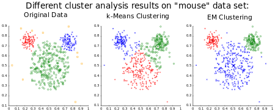

---

sort: 10

---

# 인공지능 모델

Isolation Forest, K-means, Support Vector Machine 등 3종의 인공지능 모델이 사용되었다.

  

## Isolation Forest

Isolation Forest는 분류, 회귀 분석 등에서 사용되는 앙상블 학습 방법의 일종인 Random Forest와 유사한 구조를 가지는 알고리즘으로
현재 갖고 있는 데이터 중 이상치를 탐지할 때 주로 사용된다.
Isolation Forest는 Decision Tree(결정 트리)를 기반으로 구현되며, 랜덤으로 데이터를 분류하여 모든 관측치를 고립시키는 방법으로 학습/구현된다.
변수가 많은 데이터에서도 효율적으로 작동할 수 있는 장점이 있다.

입력 된 데이터 및 과거 데이터를 기반으로 Isolation Forest를 알고리즘을 수행한 결과 고립 된 데이터가 입력 된 데이터와 같을 때 이상치로 판별한다.

  
  

※ 상세 설명 참조 문서 : [**Decision Tree**](https://ko.wikipedia.org/wiki/%EA%B2%B0%EC%A0%95_%ED%8A%B8%EB%A6%AC){:target="\_blank"}, 
[**Random Forest**](https://ko.wikipedia.org/wiki/%EB%9E%9C%EB%8D%A4_%ED%8F%AC%EB%A0%88%EC%8A%A4%ED%8A%B8){:target="\_blank"}, 
[**Isolation Forest**](https://en.wikipedia.org/wiki/Isolation_forest){:target="\_blank"},
[**Scikit-Learn**](https://scikit-learn.org/stable/modules/generated/sklearn.ensemble.IsolationForest.html#sklearn.ensemble.IsolationForest){:target="\_blank"}, 

  

## K-means

머신러닝 비지도학습에 속하는 K-means 알고리즘은 쉽게 말해 데이터를 K개의 군집으로 묶는 알고리즘이다.
K-means 알고리즘에서는 K는 묶을 군집의 개수를 의미하고 means는 평균을 의미한다.

입력 된 데이터가 K개의 군집에도 포함되지 않을 경우 이상치로 판별한다.

  

※ 상세 설명 참조 문서 : [**K-means**](https://ko.wikipedia.org/wiki/K-%ED%8F%89%EA%B7%A0_%EC%95%8C%EA%B3%A0%EB%A6%AC%EC%A6%98){:target="\_blank"}, 
[**Scikit-Learn**](https://scikit-learn.org/stable/modules/generated/sklearn.cluster.KMeans.html?highlight=kmean#sklearn-cluster-kmeans){:target="\_blank"}

  

## Support Vector Machine

Support Vector Machine(SVM)은 결정 경계, 즉 분류를 위한 일종의 기준 선(Support Vector)을 정의하는 모델이다. 그래서 분류되지 않은 새로운 점이 나타나면 경계의 어느 쪽에 속하는지 확인해서 분류 과제를 수행할 수 있게 된다. SVM 모델은 학습 방법 따라 다양한 분야에서 활용되고 있으며, 이상치 분석 분야에서는 One-class classification 기반의 SVM (One-class SVM)이 주로 사용된다. One-class SVM은 학습 과정에서 학습 데이터를 모두 포함하도록 Support Vector가 정의된다.

  

입력 된 데이터가 Support Vector 내 기존의 학습 데이터와 그 특성이 유사하지 않다면 아래 그림과 같이 Support Vector 외각에 존재하게 되며 이를 이상치로 판별한다.
 
  

※ 상세 설명 참조 문서 : [**Support Vector Machine**](https://ko.wikipedia.org/wiki/%EC%84%9C%ED%8F%AC%ED%8A%B8_%EB%B2%A1%ED%84%B0_%EB%A8%B8%EC%8B%A0){:target="\_blank"}, 
[**Scikit-Learn**](https://scikit-learn.org/stable/modules/generated/sklearn.svm.OneClassSVM.html#sklearn-svm-oneclasssvm){:target="\_blank"}

  

  

**※ 본 문서에 안내 된 알림을 제외한 문제가 발생할 경우, 구매처로 문의하시기 바랍니다.**

